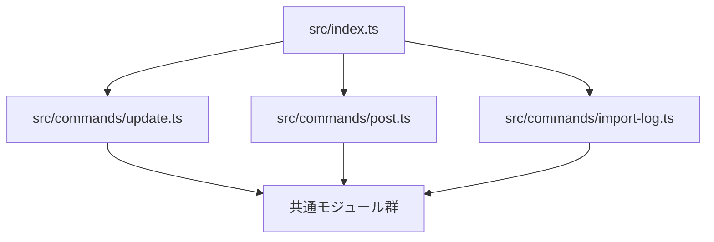

# immich_toys

Immich へメディアをアップロードするための CLI ツールです。  
TypeScript で実装されており、`node` で `.ts` を直接実行します。

## 機能

- `update`: 指定フォルダを再帰走査し、画像・動画の情報を SQLite に登録
  - 登録項目: フルパス、xxHash64、ファイルサイズ、状態など
  - 重複判定: `hash + size`（同一なら登録スキップ）
- `post`: DB に登録済みで未アップロードのファイルを Immich に送信
  - 成功時: `status=uploaded`、HTTP ステータス、アップロード時刻を記録
  - 失敗時: `status=failed`、エラー内容を記録
  - `uploaded` のファイルは再送しません
- `import-log`: 旧バージョンのログから、アップロード完了状態を DB に取り込み
  - `Uploaded:` 行（および `Skipping already uploaded file:` 行）を解析
  - DB に既存の `path` は `status=uploaded` に更新
  - DB に未登録の `path` は、ファイルが存在する場合に `hash + size` を計算して `uploaded` として登録

## 前提

- Node.js 24 以上推奨
- Yarn
- Immich API キー

## セットアップ

1. 依存をインストール

```bash
yarn install
```

2. 環境変数を設定（`.env`）

```dotenv
IMMICH_BASE_URL=http://<immich-host>:2283/api
IMMICH_API_KEY=<your_api_key>
```

`sample.env` をコピーして作成しても構いません。

## 使い方

### 1) DB 更新（メディア情報の登録）

```bash
yarn start update <TARGET_FOLDER> [DB_PATH]
```

例:

```bash
yarn start update ./immich/library/upload ./immich_toys.db
```

- `DB_PATH` 省略時は `./immich_toys.db`

### 2) Immich へアップロード

```bash
yarn start post [DB_PATH] [--exclude-videos] [--quiet-success]
```

例:

```bash
yarn start post ./immich_toys.db
yarn start post ./immich_toys.db --exclude-videos
yarn start post ./immich_toys.db --quiet-success
```

- `DB_PATH` 省略時は `./immich_toys.db`
- `--exclude-videos` を付けると、`.mp4` などの動画形式をアップロード対象から除外
- `--quiet-success` を付けると、成功時の `Uploaded: ...` ログを省略

### 3) 旧ログからアップロード済みを移行

```bash
yarn start import-log <LOG_PATH> [DB_PATH]
```

例:

```bash
yarn start import-log ./nohup.out ./immich_toys.db
```

- `DB_PATH` 省略時は `./immich_toys.db`

## ビルド

```bash
yarn build
```

## 補足

- 実行エントリ: [src/index.ts](src/index.ts)
- TypeScript 設定: [tsconfig.json](tsconfig.json)
- スクリプト定義: [package.json](package.json)

## 内部モジュール構成

- エントリポイント
  - [src/index.ts](src/index.ts): CLI引数の受け取りとコマンド振り分け
- コマンド本体
  - [src/commands/update.ts](src/commands/update.ts): フォルダ走査・ハッシュ計算・DB登録
  - [src/commands/post.ts](src/commands/post.ts): 未アップロードの送信処理
  - [src/commands/import-log.ts](src/commands/import-log.ts): 旧ログの取り込み
- 共通処理
  - [src/db.ts](src/db.ts): SQLite初期化
  - [src/media.ts](src/media.ts): 拡張子判定・ファイル再帰収集
  - [src/hash.ts](src/hash.ts): xxHash64計算
  - [src/uploader.ts](src/uploader.ts): Immich APIアップロード
  - [src/log-parser.ts](src/log-parser.ts): 旧ログ解析
  - [src/utils/progress.ts](src/utils/progress.ts): 進捗表示・ログ出力
  - [src/utils/time.ts](src/utils/time.ts): 時刻ユーティリティ
  - [src/config.ts](src/config.ts): 環境変数と既定値
  - [src/constants.ts](src/constants.ts): 拡張子定義
  - [src/types.ts](src/types.ts): 共有型定義

### モジュール依存図（Mermaid）


